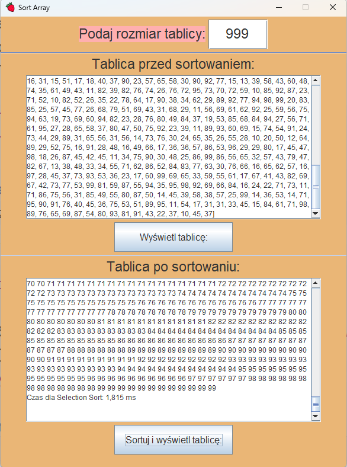

# Algorytmy Sortowania w Javie

Projekt edukacyjny w Javie prezentujący implementację klasycznych algorytmów sortowania:
- Bubble Sort
- Insertion Sort
- Selection Sort

Projekt zawiera również testy jednostkowe JUnit 5, które weryfikują poprawność działania algorytmów oraz umożliwiają pomiar czasu wykonywania.

---

## 📌 Spis treści
1. [Opis projektu](#opis-projektu)
2. [Technologie](#technologie)
3. [Instalacja](#instalacja)
4. [Użycie](#użycie)
5. [Przykład kodu](#przykład-kodu)
6. [Testy jednostkowe](#testy-jednostkowe)
7. [Zrzuty ekranu](#zrzuty-ekranu)
8. [Autor](#autor)
9. [Licencja](#licencja)

---

## 📝 Opis projektu
Projekt ma na celu:
- Poznanie klasycznych algorytmów sortowania w praktyce.
- Porównanie efektywności sortowania różnych metod.
- Wykorzystanie tablic `int[]` oraz testów jednostkowych w JUnit 5.
- Ćwiczenie pracy z losowymi danymi (`Random` i streamy).

---

## ⚙️ Technologie
- Java 17
- Swing (GUI)
- JUnit 5 (testy jednostkowe)
- Random streams w Javie 8+

---

## 💻 Instalacja
```bash
# Sklonuj repozytorium
git clone https://github.com/TwójNick/algorytmy-sortowania.git

# Przejdź do katalogu projektu
cd algorytmy-sortowania

# Kompilacja
javac -d bin src/**/*.java

# Uruchomienie GUI (przykład)
java -cp bin cwiczenia10.Main
```

## 🚀Użycie
## 📌 Przykład kodu
```java
 przyciskSortujTablice.addActionListener(new ActionListener() {
            @Override
            public void actionPerformed(ActionEvent e) {
                areaWypiszPosortowanaTablice.setText("");
                // konwersja List<Integer> → int[]
                int[] arr = liczby.stream().mapToInt(Integer::intValue).toArray();

                Algorithms alg = new Algorithms();

                // przykładowo testujemy każdy algorytm osobno
                testSort("Bubble Sort", arr.clone(), alg::bubbleSort);
                testSort("Insertion Sort", arr.clone(), alg::insertionSort);
                testSort("Selection Sort", arr.clone(), alg::selectionSort);
               // for (Integer i: liczby) areaWypiszPosortowanaTablice.append(i+" ");
            }
        });
```
## 🧪 Testy jednostkowe
```java
 @Test
    void insertionSortPreemptive() {
        int[] expected = arr.clone();
        Arrays.sort(expected);

        assertTimeoutPreemptively(Duration.ofSeconds(5),
                () -> {
                    int[] copy = arr.clone();
                    algorithms.insertionSort(copy);
                    assertArrayEquals(expected, copy,
                            "Insertion Sort nie posortował tablicy poprawnie!");
                },
                "Insertion Sort przekroczył maksymalny czas wykonania!");
    }
```
## 🖼️Zrzuty


## 👤Autor

