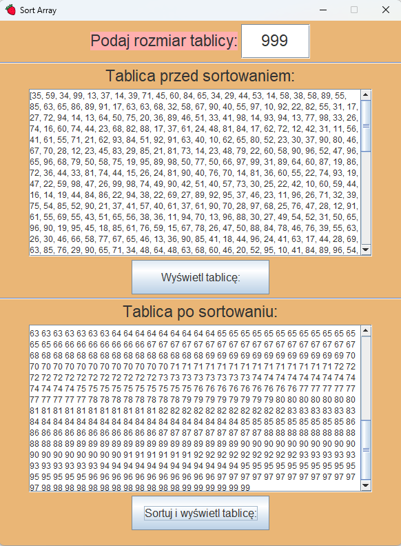

# Cw10TextAreaFolwLayoutSort

```java
przyciskWczytajTablice.addActionListener(new ActionListener() {
            @Override
            public void actionPerformed(ActionEvent e) {
                String dlTablicy = poleDlugoscTablicy.getText();
                int dlugoscTablicy = Integer.parseInt(dlTablicy);
                Random random = new Random();
                for (int i = 0; i < dlugoscTablicy; i++) {
                    liczby.add(random.nextInt(9,99)+1);
                }
                println("Liczby: "+ liczby);
                areaWypiszTablice.setText(liczby.toString());
            }
        });
```